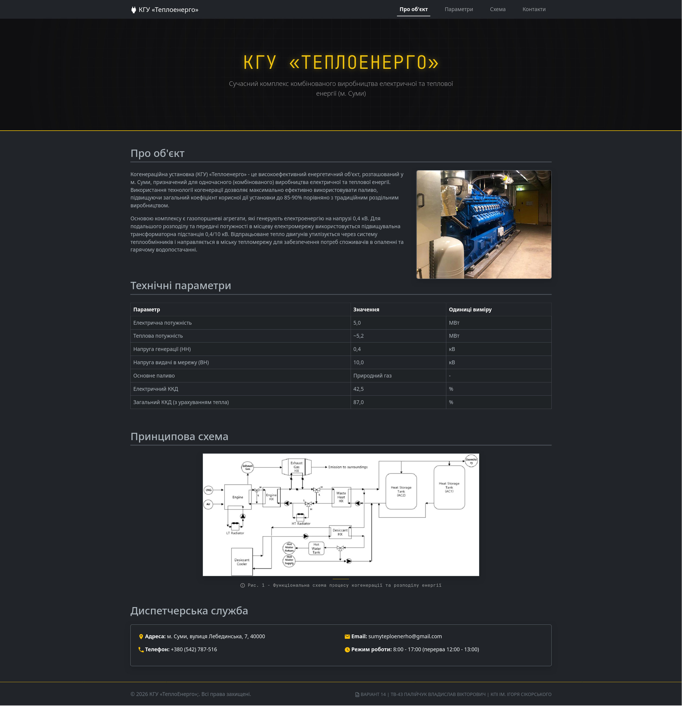

# Практична робота №1

## Постановка завдання
Завдання полягає у проєктуванні односторінкового сайту для інформаційного порталу енергетичного об’єкта (у нашому випадку, когенераційної установки), що містить
- заголовок і підзаголовок
- опис об’єкта
- таблицю параметрів (наприклад, потужність, напруга)
- зображення 
- навігаційне меню
- стилізацію за допомогою CSS (власний стиль + Bootstrap).

Об'єкт за варіантом 14:
| Варіант | Тип | Потужність | Напруга | Місцезнаходження |
|---------|-----|------------|---------|------------------|
| №14 | Когенераційна установка | 5 МВт | 0,4/10 кВ | м. Суми |

## Результат виконання

