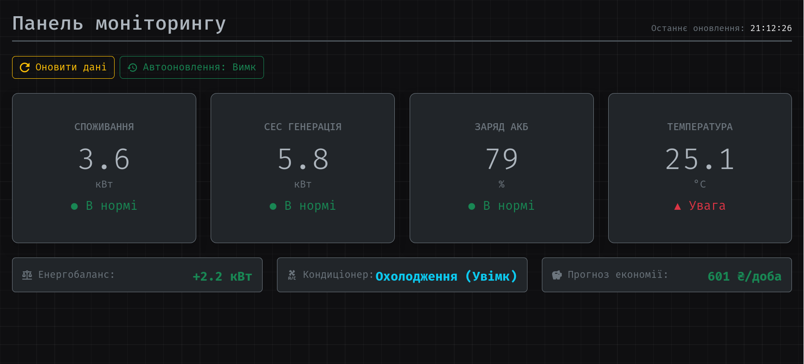

# Практична робота №2

## Постановка завдання
Завдання полягає у проєктуванні вебсторінки, де відображаються дані моніторингу енергетичного об’єкта (або, у нашому випадку, розумного будинку), що оновлюються кнопками або таймером (напр., зміна потужності, напруги, стану пристрою).
1. Спроєктувати структуру веб-сторінки для моніторингу енергетичного об'єкта
2. Реалізувати динамічне оновлення параметрів за допомогою JavaScript
3. Додати можливість ручного оновлення (кнопки)
4. Реалізувати автоматичне оновлення (таймер)
5. Додати візуальну індикацію стану параметрів
6. Протестувати роботу сторінки

Об'єкт за варіантом 14:
| Варіант | Тип              | Загальне споживання       | Сонячна генерація       | Стан батареї       | Температура в будинку |
|---------|------------------|---------------------------|-------------------------|--------------------|-----------------------|
| №14     | Розумний будинок | 0-15 кВт (норма 2-10 кВт) | 0-8 кВт (норма 1-7 кВт) | 10 кВт·год, 40-90% | 18-26C (норма 20-24C) |

## Результат виконання

